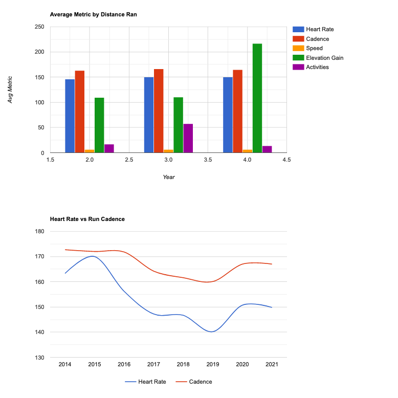

<!--
*** Thanks for checking out the Best-README-Template. If you have a suggestion
*** that would make this better, please fork the repo and create a pull request
*** or simply open an issue with the tag "enhancement".
*** Thanks again! Now go create something AMAZING! :D
-->


<!-- PROJECT SHIELDS -->
<!--
*** I'm using markdown "reference style" links for readability.
*** Reference links are enclosed in brackets [ ] instead of parentheses ( ).
*** See the bottom of this document for the declaration of the reference variables
*** for contributors-url, forks-url, etc. This is an optional, concise syntax you may use.
*** https://www.markdownguide.org/basic-syntax/#reference-style-links
-->

[![MIT License][license-shield]][license-url]
[![LinkedIn][linkedin-shield]][linkedin-url]


<!-- PROJECT LOGO -->
<br />

<p align="center">
  <a href="https://github.com/othneildrew/Best-README-Template">
    
  </a>

  <h3 align="center">Garmin Running Analysis</h3>

  <p align="center">
    Quuck package created to analyze data from Garmin Connect
    <br />
    <a href="https://connect.garmin.com/"><strong>Garmin Connect »</strong></a>
    <br />
    <br />
    <a href="/dist/garmin_analysis-0.1-py3-none-any.whl">Latest Package</a>
    ·
    <a href="https://anna-koretchko.ue.r.appspot.com/garmin">Demo</a>

  </p>
</p>


<!-- TABLE OF CONTENTS -->
<details open="open">
  <summary>Table of Contents</summary>
  <ol>
    <li>
      <a href="#about-the-project">About The Project</a>
      <ul>
        <li><a href="#built-with">Built With</a></li>
      </ul>
    </li>
    <li>
      <a href="#getting-started">Getting Started</a>
      <ul>
        <li><a href="#prerequisites">Prerequisites</a></li>
        <li><a href="#installation">Installation</a></li>
      </ul>
    </li>
    <li><a href="#usage">Usage</a></li>
    <li><a href="#roadmap">Roadmap</a></li>
    <li><a href="#contributing">Contributing</a></li>
    <li><a href="#license">License</a></li>
    <li><a href="#contact">Contact</a></li>
    <li><a href="#acknowledgements">Acknowledgements</a></li>
  </ol>
</details>


<!-- ABOUT THE PROJECT -->
## About The Project

[![Product Name Screen Shot][product-screenshot]](https://example.com)

I am an avid running and love using my Garmin Forerunner 945 to collect all the data available while I run. Over the past 8 years, I have accumulated quite a large amount of data. I created this python package for anyone to analyse their Garmin Data from the Garmin Connect site and gain deeper understanding about their running analytics!

If you wanna try on your own but don't have a Garmin account, feel free to use the data in the demo-data folder!


* If you wanna try on your own but don't have a Garmin account, feel free to use the data in the demo-data folder!


### Built With

This section should list any major frameworks that you built your project using. Leave any add-ons/plugins for the acknowledgements section. Here are a few examples.
* [Python](https://www.python.org/)


<!-- GETTING STARTED -->
## Getting Started

How to run:

Downdload lastest whl from from the dist folder (here)

create env

cd to downloaded whl file

pip install whl file

python -m garmin_analysis -data "<path to data file from Garmin Connect" -output_path "<path to where you want the output files to be saved"
### Prerequisites

Python is the only requirement for this project (however, enviroment managers such as conda are greatly suggested as well)
* python
  ```sh
  sudo apt-get install python3.6
  ```

### Installation and Example Run

1. Create conda environment for garmin_analyis project ([install conda Here](https://conda.io/projects/conda/en/latest/user-guide/install/index.html))

2. Downdload lastest wheel (whl) from from the dist folder [here] (/dist/garmin_analysis-0.1-py3-none-any.whl)

3. cd to the downloaded wheel file
   ```sh
   (garmin_env) cd Downloads/garmin_analysis-0.X-py3-none-any.whl
   ```
4. pip install `garmin_analysis-0.X-py3-none-any.whl` to your newly created conda environment
   ```sh
   (garmin_env) pip install garmin_analysis-0.X-py3-none-any.whl
   ```
5. Now run the package which requires two inputs: -data and -output_path 
    ```sh
    (garmin_env) python -m garmin_analysis -data "<path to data file from Garmin Connect" -output_path "<path to where you want the output files to be saved"
    ```

<!-- USAGE EXAMPLES -->
## Usage

Use this space to show useful examples of how a project can be used. Additional screenshots, code examples and demos work well in this space. You may also link to more resources.

_For more examples, please refer to the [Documentation](https://example.com)_


<!-- ROADMAP -->
## Roadmap

See the [open issues](https://github.com/othneildrew/Best-README-Template/issues) for a list of proposed features (and known issues).


<!-- CONTRIBUTING -->
## Contributing

Contributions are what make the open source community such an amazing place to be learn, inspire, and create. Any contributions you make are **greatly appreciated**.

1. Fork the Project
2. Create your Feature Branch (`git checkout -b feature/AmazingFeature`)
3. Commit your Changes (`git commit -m 'Add some AmazingFeature'`)
4. Push to the Branch (`git push origin feature/AmazingFeature`)
5. Open a Pull Request


<!-- LICENSE -->
## License

Distributed under the MIT License. See `LICENSE` for more information.


<!-- CONTACT -->
## Contact

Your Name - [@your_twitter](https://twitter.com/your_username) - email@example.com

Project Link: [https://github.com/your_username/repo_name](https://github.com/your_username/repo_name)


<!-- ACKNOWLEDGEMENTS -->
## Acknowledgements
* [GitHub Emoji Cheat Sheet](https://www.webpagefx.com/tools/emoji-cheat-sheet)
* [Img Shields](https://shields.io)
* [Choose an Open Source License](https://choosealicense.com)
* [GitHub Pages](https://pages.github.com)
* [Animate.css](https://daneden.github.io/animate.css)
* [Loaders.css](https://connoratherton.com/loaders)
* [Slick Carousel](https://kenwheeler.github.io/slick)
* [Smooth Scroll](https://github.com/cferdinandi/smooth-scroll)
* [Sticky Kit](http://leafo.net/sticky-kit)
* [JVectorMap](http://jvectormap.com)
* [Font Awesome](https://fontawesome.com)


<!-- MARKDOWN LINKS & IMAGES -->
<!-- https://www.markdownguide.org/basic-syntax/#reference-style-links -->
[contributors-shield]: https://img.shields.io/github/contributors/othneildrew/Best-README-Template.svg?style=for-the-badge
[contributors-url]: https://github.com/othneildrew/Best-README-Template/graphs/contributors
[forks-shield]: https://img.shields.io/github/forks/othneildrew/Best-README-Template.svg?style=for-the-badge
[forks-url]: https://github.com/othneildrew/Best-README-Template/network/members
[stars-shield]: https://img.shields.io/github/stars/othneildrew/Best-README-Template.svg?style=for-the-badge
[stars-url]: https://github.com/othneildrew/Best-README-Template/stargazers
[issues-shield]: https://img.shields.io/github/issues/othneildrew/Best-README-Template.svg?style=for-the-badge
[issues-url]: https://github.com/othneildrew/Best-README-Template/issues
[license-shield]: https://img.shields.io/github/license/othneildrew/Best-README-Template.svg?style=for-the-badge
[license-url]: https://github.com/annakoretchko/garmin_analysis/blob/master/LICENSE
[linkedin-shield]: https://img.shields.io/badge/-LinkedIn-black.svg?style=for-the-badge&logo=linkedin&colorB=555
[linkedin-url]: https://www.linkedin.com/in/anna-koretchko-1b5b0211a/
[product-screenshot]: images/screenshot.png

